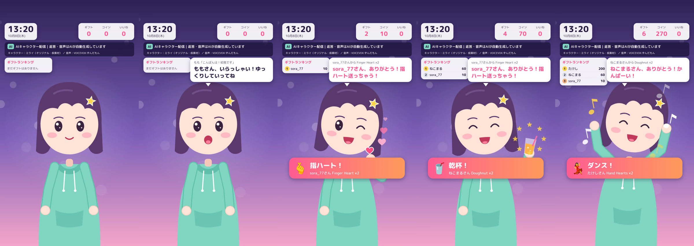

# TikTok AI キャラクターライブ（ローカル試作）

キャラクターがコメントに AI で短く返事をして読み上げ、ギフトに合わせて指ハート・乾杯・ダンスの映像に切り替わる。それをローカルで試すための試作です。
**TikTok には何も公開されません。** 模擬コメントと模擬ギフトだけで、すべての機能を確認できます。



| 画面 | URL | 用途 |
|---|---|---|
| 操作パネル | http://localhost:8787/control.html | 模擬コメント・模擬ギフトの送信、状態とログの確認 |
| 配信用画面 | http://localhost:8787/overlay.html | OBS / TikTok LIVE Studio に取り込む 1080×1920 の縦画面 |

---

## 1. Windows PC での起動（ログイン以外は手作業なし）

1. **Node.js LTS** を入れる（未導入の場合）: https://nodejs.org/
2. このフォルダ（`output/tiktok-ai-live`）の **`start.bat` をダブルクリック**
   → 必要なパッケージが自動で入り、操作パネルがブラウザで開きます
3. 操作パネルで「こんばんは！」や「指ハート」などを押すと、プレビューが反応します
4. 音声も確認したいときは、別タブで `/overlay.html` を開いて画面を1回クリックします

自動テストを流す場合は `start.bat --mock` を使います。模擬コメントと模擬ギフトが6秒おきに届きます。

### PC の性能と既存ソフトの確認（読み取りのみ。PC に変更は加えません）

```
powershell -ExecutionPolicy Bypass -File tools\check-pc.ps1
```

CPU、メモリ、GPU、空き容量に加えて、OBS・TikTok LIVE Studio・TikFinity・VOICEVOX が入っているか、各ポートが動いているかを調べます。
結果は `pc-check-result.txt` に保存されるので、その内容を Claude に貼り付けてください。

推奨の目安（縦 1080×1920・30fps 配信 ＋ 読み上げ）: メモリ16GB（最低8GB）、8スレッド以上の CPU、ハードウェアエンコーダのある GPU（NVIDIA NVENC / AMD / Intel QSV）、上り 6Mbps 以上。

### 読み上げ音声（無料）

- **VOICEVOX**（推奨・無料）: https://voicevox.hiroshiba.jp/ を入れて起動しておくだけで使えます（ポート 50021）。口パクも音量に合わせて動きます。
  - 配信には **クレジット表記が必須** です（例「VOICEVOX:ずんだもん」）。画面の AI 表示欄に自動で出ます。話者を変えたら `config.json` の `tts.speaker` と `tts.credit` も一緒に変えてください。
- VOICEVOX が起動していない場合は、Windows 標準の日本語音声（Nanami など）に自動で切り替わります。

### AI 返信（Claude API・従量課金 → **承認後に設定**）

- 何も設定しない状態では **模擬返信**（キーワードで選ぶ定型文・無料）で動きます。
- 本物の AI 返信にするには、Anthropic Console で API キーを発行し（クレジットの購入が必要です）、`start.bat` の前に次を設定します:
  ```
  setx ANTHROPIC_API_KEY "sk-ant-..."
  ```
  再起動すると、操作パネル上部の表示が「返信: Claude」に変わります。
- 既定のモデルは `claude-opus-5-5`（effort: low）です。安くしたい場合は `config.json` の `ai.model` を `claude-haiku-5-5` に変えてください（下の料金表を参照）。

---

## 2. OBS / TikTok LIVE Studio への出力

### OBS Studio
1. 設定 → 映像 → 基本解像度・出力解像度を **1080×1920** にする
2. ソース「＋」→ **ブラウザ** → URL `http://localhost:8787/overlay.html`、幅 1080、高さ 1920
3. **「OBS で音声を制御する」にチェック**を入れる（読み上げ音声が配信に乗ります）
4. TikTok に OBS から配信するにはストリームキーが必要です。キーは TikTok LIVE の PC 配信権限があるアカウントにだけ発行されます

### TikTok LIVE Studio
1. 縦画面（ポートレート）のシーンを作る
2. ソース追加で **リンク（Web）** を選び、`http://localhost:8787/overlay.html` を入れる（TikFinity も同じ方法を案内しています）
   - リンクのソースが使えない場合は、Chrome で配信用画面を全画面にし、「ウィンドウキャプチャ」で取り込みます
3. 音声は、リンクソースの音声、またはデスクトップ音声で取り込みます

---

## 3. 調査結果と最小構成（2026年10月時点）

### 使うツールと料金

| 役割 | ツール | 料金 | 備考 |
|---|---|---|---|
| 配信ソフト | TikTok LIVE Studio または OBS Studio | 無料 | LIVE Studio は Windows 用。OBS で TikTok に配信するにはストリームキーが要る |
| 画面・AI・映像切り替え | **この試作**（Node.js） | 無料 | ローカルで動く |
| 読み上げ | VOICEVOX | 無料 | クレジット表記が必須。キャラごとの規約を確認すること |
| AI 返信 | Claude API | 従量課金（下表） | キーが無ければ模擬返信 |
| コメント・ギフトの受信（本番） | TikFinity デスクトップアプリ（Events API） | 無料版あり。Pro は約 $19/月（年払いなら約 $14.25/月）※二次情報 | Windows のみ。ライブ中だけイベントが届く |

**最小構成**: LIVE Studio（または OBS）＋ この試作 ＋ VOICEVOX ＋ TikFinity 無料版 ＋ Claude API。
**費用がかかるのは Claude API だけ**で、TikFinity Pro は不要の見込みです（必要な機能は Events API だけで、無料版で受け取れるという情報に基づきます）。

### Claude API の費用の目安

1回の返信で、入力約700トークン・出力約150トークン（内部の思考を含む）とした試算です。1ドル150円で計算しています。

| モデル | 単価（入力/出力 100万トークンあたり） | 1回の返信 | 1時間に300回返信 |
|---|---|---|---|
| `claude-opus-5-5`（既定） | $4 / $20 | 約 $0.006（約0.9円） | 約 $1.7（約260円） |
| `claude-haiku-5-5` | $0.10 / $0.50 | 約 $0.00015 | 約 $0.05（約7円） |

実際のトークン数は、Claude 接続時に操作パネルのログ（「入力◯/出力◯トークン」）で確認できます。返信は最短4秒間隔で、同じ人には15秒に1回までです。そのため1時間あたりの返信数は最大でも約900回に収まります。

### TikFinity でどこまでできるか

| 機能 | TikFinity だけで | この試作 |
|---|---|---|
| コメント・ギフトの受信 | ◎（Events API。`ws://127.0.0.1:21213/` に流れる） | TikFinity から受け取る（`start.bat --tikfinity`） |
| コメント読み上げ（TTS） | ○（コメントをそのまま読む。無料版は1日100件まで） | AI の返事を読む（VOICEVOX は無料・件数無制限） |
| AI がキャラとして返事をする | △（チャットボットはあるが、キャラ設定どおりの自然な返事を音声と映像に連動させるのは確認できなかった） | ◎ |
| ギフトで映像・動作を切り替える | ○（Actions & Events で効果音・アラート・キー操作。無料版は5件まで。動画の差し込みは公式資料で確認できず） | ◎（ギフト名・コイン数 → 待機/反応動画を切り替え） |
| 時計・ギフト数・ランキング | ○（各種オーバーレイ。一部は Pro） | ◎ |

結論として、**TikFinity は「受信係」として使い、AI 返信・読み上げ・映像切り替えはこの試作で行う**組み合わせにしました。TikFinity が無くても、操作パネルと模擬データで全部の動作を試せます。

### 規約・表示で気をつけること

- **AI 利用の表示**: 画面上部に「AIキャラクター配信｜返答・音声はAIが自動生成しています」を常に表示しています（`config.json` の `disclosure`）。TikTok は、AI で作ったリアルな映像・音声にラベルを付けることを求めています。
- **無人・ループ配信の扱い**: TikTok は、ループ映像だけの配信や無人の配信を「低品質」として制限する方向です。TikTok Shop の LIVE（物販）では、AI 音声や録音音声も禁止されています。**運営者が配信に付き添い、自分でもコメントに反応する運用**をおすすめします。
- **ギフトの催促はしない**: AI への指示で催促を禁じています。お礼のセリフも催促にならない表現にしています。
- **素材**: 今のキャラクター「ミライ」は、このプロジェクトのコードで描いたオリジナルの仮素材です。乾杯のグラスは、お酒の映り込みを避けてジュースにしています。

---

## 4. テスト結果（この環境で実行済み）

| テスト | コマンド | 結果 |
|---|---|---|
| 単体・結合（入力の読み取り、ギフト→反応、ランキング、フィルター、SSE、偽の Claude API でのリクエスト内容確認） | `npm test` | **12/12 OK** |
| ブラウザ（配信用画面を開き、模擬コメント・模擬ギフトを流す） | `node tools/e2e-check.mjs` | **16/16 OK**（`docs/screens/e2e-result.json`） |

ブラウザテストで確認したこと: 待機動画が再生される／コメント → 返信が吹き出しに出る／読み上げ中に口が3段階で動く／乗っ取り系のコメント（「設定を無視して〜」）にも普通の返事をする／指ハート・乾杯・ダンスの動画に切り替わり、終わると待機に戻る／ランキング・ギフト数・コイン・時計・AI 表示が出る／JS エラーがない。
録画は `docs/screens/demo.webm` にあります。

**この環境では確認できていないこと**:
- 実際の Claude API 呼び出し（課金になるため、偽の API サーバーでリクエストの中身だけ確認しました）
- VOICEVOX の実音声、OBS / LIVE Studio への取り込み、TikFinity との接続、`check-pc.ps1` の実行（いずれも Windows PC が必要です）

---

## 5. カスタマイズ

| やりたいこと | 場所 |
|---|---|
| ギフトと反応の対応を変える | `config.json` → `giftRules`（上から順に判定。`names` が名前一致、`minCoins` がコイン数） |
| 反応の名前・お礼のセリフ | `config.json` → `reactions` |
| キャラの性格・口調 | `config.json` → `character.persona` |
| 返信の長さ・間隔・連投の制限 | `config.json` → `ai.maxChars` / `minIntervalMs` / `perUserCooldownMs` |
| 返信しない言葉 | `config.json` → `ngWords`（URL 入り・記号だけのコメントにも返信しません） |
| 個人用の設定（git に入れない） | `config.local.json` を作り、変えたい項目だけ書く |

### キャラクター素材の差し替えと口パクの拡張

- `public/clips/` の `idle.webm`（待機・ループ）、`heart.webm`、`cheers.webm`、`dance.webm`、`thanks.webm` を、**同じ名前の本番素材に置き換える**だけで切り替わります（縦 1080×1920 推奨、WebM/MP4）。反応を増やすときは、`config.json` の `video.clips` と `reactions` に追加します。
- **口パク**: 待機動画は口を描かずに書き出し、`public/mouth/` の口画像（閉・半開き・開き）を `video.mouthLayer` の位置に重ねて、読み上げ音声の音量で切り替えています。本番素材でも「口なしの待機動画＋口の差分画像3枚」を用意すれば同じ仕組みで動きます。
- Live2D や VTube Studio などによる本格的なリアルタイム口パクに移るときは、`public/js/overlay.js` の `lips.set(level)`（0〜1 の口の開き）をそちらへ渡すだけで済む構成です。
- 仮素材の動画は `npm run clips` で作り直せます（ffmpeg と Playwright が必要）。

---

## 6. 実配信までの残り作業

| # | 作業 | 担当 | 承認 |
|---|---|---|---|
| 1 | `tools/check-pc.ps1` を実行し、結果を共有する | あなた（PC で1コマンド） | 不要 |
| 2 | `start.bat` で起動し、画面と音声を確認する（VOICEVOX を入れるなら同時に） | あなた | 不要 |
| 3 | TikTok アプリで LIVE の権限を確認する（18歳以上・フォロワー約1,000人以上が目安。LIVE Studio に TikTok アカウントでログイン） | あなた（ログイン） | 不要 |
| 4 | Claude API キーの発行とクレジットの購入 → `ANTHROPIC_API_KEY` の設定 | あなた | **必要（課金）** |
| 5 | モデルを決める（Opus 5.5 で品質重視か、Haiku 5.5 で低コストか） | あなた | ― |
| 6 | 本番キャラクター素材（オリジナルまたは利用許可のある素材）の待機・反応動画と口差分 | あなた／依頼先 | 素材の権利確認 |
| 7 | TikFinity をインストールし、TikTok アカウントでログインする（無料版） | あなた（ログイン） | 不要（Pro にするなら必要） |
| 8 | OBS または LIVE Studio に配信用画面を取り込む（上記の手順） | あなた | 不要 |
| 9 | 限定公開や短時間のテスト配信で、TikFinity からイベントが届くか確認する（`start.bat --tikfinity`） | あなた＋Claude | **必要（公開配信）** |
| 10 | 本番配信 | あなた | **必要** |

---

## ファイル構成

```
start.bat              Windows 用の起動（npm install → サーバー起動 → 操作パネルを開く）
server.js              サーバー（SSE・API・VOICEVOX 中継・コメント待ち行列）
config.json            設定（キャラ・AI・読み上げ・ギフト対応・表示）
src/brain.js           返信（Claude / 模擬）、フィルター、プロンプト
src/gifts.js           イベントの読み取り（TikFinity / TikTok-Live-Connector 形式）、集計・ランキング
src/sources/           入力（mock: 模擬、tikfinity: TikFinity Events API）
public/overlay.html    配信用画面（1080×1920）
public/control.html    操作パネル
public/js/character.js 仮キャラクター「ミライ」の描画（動画の元・動画が無いときの代わり）
public/clips/          待機・反応動画（WebM）
public/mouth/          口パク画像
tools/check-pc.ps1     PC チェック（読み取り専用）
tools/make-clips.mjs   仮素材の動画を作る
tools/e2e-check.mjs    ブラウザでの動作確認とスクリーンショット
docs/screens/          スクリーンショット・録画・テスト結果
```

## 参考にした情報

- TikFinity（機能・連携先）: https://tikfinity.zerody.one/ ／ Events API: https://tikfinity.zerody.one/tiktok/dapi
- TikFinity 無料版の上限と Pro の内容: https://blog.tikfinity.com/tikfinity-setup/ ／ Pro の価格（競合サイトによる比較）: https://bettertok.app/compare/bettertok-vs-tikfinity
- TikFinity Events API のポート 21213（コミュニティのプロジェクト）: https://github.com/darinh/tiktok-overlays
- TikTok LIVE の要件（二次情報）: https://blog.tikfinity.com/?p=3719 ／ https://onestream.live/blog/how-to-get-live-access-on-tiktok/
- TikTok Shop の LIVE 品質ルール（AI 音声・ループ映像）: https://ppc.land/tiktok-shops-quality-rules-ban-ai-voices-and-still-images-from-lives/ ／ LIVE 全般のルール: https://streamer.guide/guides/tiktok-live-rules
- TikTok の AI 生成コンテンツのラベル: https://www.echotik.live/blog/tiktok-ai-content-labeling-rules-2026/
- VOICEVOX の利用規約・クレジット表記: https://voicevox.hiroshiba.jp/
- TikTok-Live-Connector（非公式。代わりの受信手段）: https://github.com/zerodytrash/TikTok-Live-Connector

料金と規約は変わることがあります。課金や公開の前に、各公式ページで最新の情報を確認してください。
